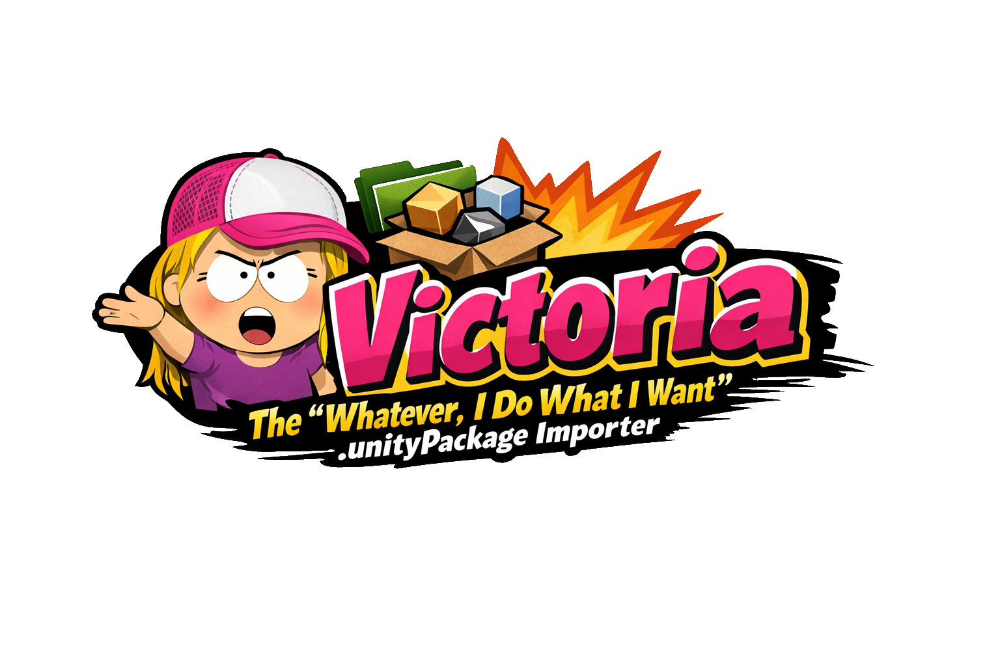
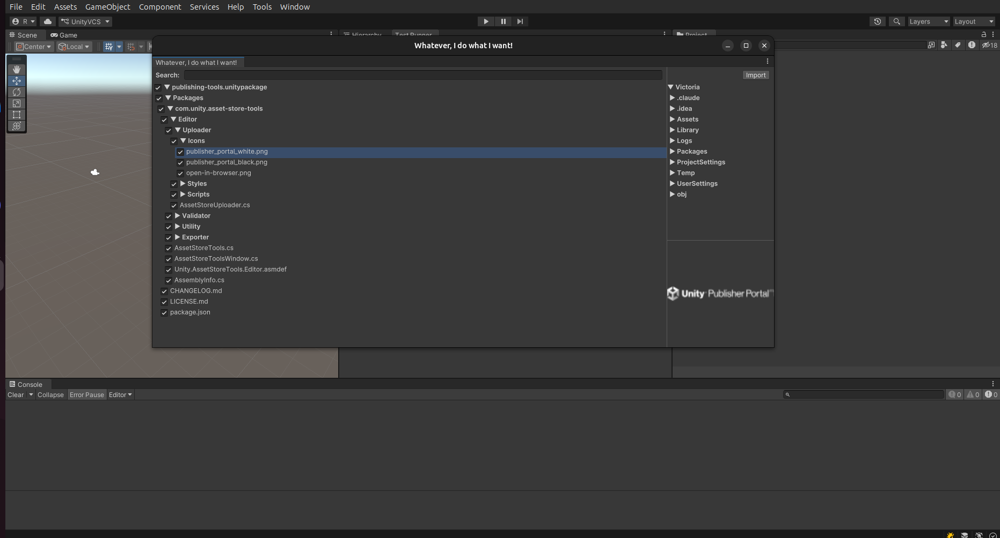

# Victoria — *"Whatever, I do what I want!"*



> *"You're not my real mom, Unity. You can't tell me where to put my files."*
> — Victoria, probably

---

You've been there. You double-click a `.unitypackage`. Unity opens its little import dialog. You click **Import**. And suddenly your project has a `Assets/SomeRandom/Vendor/DeepNested/Scripts/Utilities/Helpers/Manager/` folder shoved right into your carefully curated directory structure. No warning. No negotiation. Just files, **wherever the package author felt like putting them** on the day they made it.

Well. Not anymore.

**Victoria** is the *"Whatever, I do what I want"* `.unitypackage` importer. She doesn't care what the package author intended. She doesn't care about their folder structure. She reads the package, shows you what's inside, and then — and this is the important part — **lets YOU decide where everything goes**.

---

## Features

### Browse Before You Commit — *"I'm not importing that."*

Victoria opens a full tree view of every folder and file inside the `.unitypackage`. You can poke around, judge the structure, and decide you absolutely do not want `TheirScripts/Utils/StringExtensions.cs` cluttering up your project before you've even imported a single byte. Checkboxes let you select exactly what you want and skip the rest.

### Drag & Drop to Wherever You Please — *"I'll put it HERE. Because I want to."*

See that script? Drag it to your `Scripts/` folder. See that texture? Drop it in `Art/Environment/`. You are not a victim of someone else's folder conventions. The right-hand panel shows your actual project structure, and you can drop package assets directly into any folder you like. Total control. Zero compromises.

*The drag and drop system is internally called `SleurEnPleur`, which is Dutch for "drag and dump". You're welcome.*

### Asset Preview — *"Let me look at it first."*

Click any file in the package tree and Victoria shows you what's inside before you import it. She supports:

- **Text files** — `.cs`, `.json`, `.md`, `.txt`, `.uss`, `.uxml`, `.asmdef`, `.asset`, `.meta` — full scrollable source code view
- **Images** — renders the thumbnail preview baked into the package
- **Audio** — `.mp3`, `.wav`, `.ogg` — play button included, no questions asked
- **3D Models** — `.fbx`, `.dae`, `.obj`, `.3ds`, `.dxf` — she sees them, she acknowledges them

If there's no preview available she'll tell you straight up. No drama. Well, some drama.

### Search — *"Where is it?! I KNOW it's in here."*

The package tree has a search bar. Type a name, Victoria runs a breadth-first search through the entire package structure and highlights the matching nodes. Finding that one script buried six folders deep has never been more satisfying.



### Runtime Import — *"I don't need the editor. I NEVER needed the editor."*

Yes, Addressables exist. Yes, AssetBundles exist. Victoria is aware. Victoria imports `.unitypackage` files at runtime anyway, on a Tuesday afternoon, just because she can.

This is a pure API. No file explorer, no window, no cross-platform file picker nonsense. You give Victoria a path. She does the rest.

```csharp
var importer = new VictoriaRuntimeImporter();
await importer.ImportAsync("path/to/your.unitypackage");
// Files are now in Application.persistentDataPath.
// Load them however you want. Victoria is not your mom.
```

Once she's done, everything is sitting in `Application.persistentDataPath` and Victoria has moved on with her life. What happens next is entirely your business. Load a `.fbx` with your favorite runtime model loader. Play back audio. Hotpatch your game with fresh assets without touching a build. Use whatever third-party library you want for whatever asset type you want. She does not care. She put the files on disk. Her job is done.

---

## Installation

Add the package via the Unity Package Manager using the git URL:

```
https://github.com/HamerSoft/Victoria.git
```

Or add it directly to your `manifest.json`:

```json
{
  "dependencies": {
    "com.hamersoft.victoria": "https://github.com/HamerSoft/Victoria.git"
  }
}
```

**Unity 2019.4 or higher.** Victoria has standards.

---

## Usage

1. Go to **Tools → HamerSoft → Victoria → Import Package**
2. Select your `.unitypackage` file
3. The window opens, titled *"Whatever, I do what I want!"*
4. Browse the package tree on the left. Search if you need to. Click files to preview them on the right.
5. Check the files and folders you actually want.
6. Drag them to wherever you want them in your project's folder structure on the bottom-right panel.
7. Hit **Import**.
8. Bask in the glory of a project structure that is *yours*.

---

## Why "Victoria"?

Because sometimes a package author puts their files in `Assets/TheirCompanyName/TheirProductName/Version/1_0/Runtime/Scripts/Core/` and you just want to scream *"WHATEVER! I DO WHAT I WANT!"* and put them in `Scripts/` like a normal person.

Victoria gets it. Victoria is you.

---

## Contributing

PRs welcome. Victoria has no gatekeepers. She does what she wants — and so can you.

- [Documentation](https://hamersoft.github.io/Victoria/)
- [Changelog](https://github.com/HamerSoft/Victoria/releases)
- [Report Issues](https://github.com/HamerSoft/Victoria/issues)

---

*Made by [HamerSoft](https://hamersoft.com) — inspired by a very specific energy.*
